# Handcrafted Feature Optimisation and Classifier Benchmarking for Brain Tumor MRI Classification

**Authors:** Ferrah Othmane, Ilham El Ouariachi  
**Affiliation:** Department of Computer Science, University of Moulay Ismail, Morocco  
**Email:** o.ferrah@edu.umi.ac.ma

**Keywords:** Brain Tumor MRI, Handcrafted Features, Feature Optimization, Texture Analysis, GLCM, LBP, DWT, HOG, Machine Learning, Classifier Benchmarking, Statistical Validation

---

## Abstract

Brain tumor classification from magnetic resonance imaging (MRI) supports triage of glioma, meningioma, and pituitary lesions.
Most studies apply default parameters to handcrafted texture descriptors or couple exhaustive grid search to a single classifier, introducing optimisation bias and high compute cost.
We present a two-phase framework on a public MRI dataset of $3,064$ T1-weighted contrast-enhanced axial slices across three naturally imbalanced tumor classes (glioma, meningioma, pituitary): Phase 1 selects GLCM, LBP, DWT, and HOG hyperparameters using three classifier-free separability metrics (Fisher discriminant ratio, mutual information, Davies–Bouldin index) over 213 configurations; Phase 2 benchmarks eight classical models (SVM, KNN, random forest, XGBoost, LightGBM, logistic regression, MLP, ExtraTrees) with stratified 5-fold `GridSearchCV` on eight optimised feature compositions.
The best cross-validated configuration pairs a polynomial-kernel SVM with the fused $Full(opt)$ representation (accuracy $=0.920$, macro-F1 $=0.920$, Cohen's $κ=0.88$); optimized HOG features alone reach macro-F1 $=0.903$ with SVM, and KNN on $Full(opt)$ achieves macro-F1 $=0.900$.
Mean performance across classifiers confirms that fusion ($Full(opt)$, mean F1 $=0.887$) outperforms individual descriptor families, with gradient descriptors ($D$, mean F1 $=0.865$) ranking highest among single-family sets.
Full statistical validation (Cohen's $κ$, bootstrap confidence intervals, McNemar, Wilcoxon, Friedman–Nemenyi) is reported for all 64 classifier–feature-set pairs.
These results show that separability-guided handcrafted features with rigorous classical benchmarking achieve strong MRI classification without deep learning or GPU training.

---

## Introduction

Brain tumors represent one of the most critical neurological disorders,
requiring accurate and timely diagnosis to improve treatment planning and
patient outcomes. Magnetic Resonance Imaging (MRI) is widely used for brain
tumor assessment because of its superior soft-tissue contrast and
non-invasive nature. However, manual interpretation of MRI scans remains
challenging due to the substantial variability in tumor appearance, shape,
size, location, and texture. Consequently, computer-aided diagnosis (CAD)
systems have emerged as valuable tools for assisting radiologists in the
classification of brain tumors [ottoni2025].

Recent advances in artificial intelligence have significantly improved
medical image analysis. Deep learning models, particularly Convolutional
Neural Networks (CNNs), have achieved remarkable performance in brain tumor
classification tasks [ottoni2025]. Nevertheless, these approaches often
require large annotated datasets, extensive computational resources, and
specialized hardware for training. Furthermore, their decision-making
process is frequently difficult to interpret, which may limit their adoption
in clinical environments where transparency and explainability are important
considerations [ottoni2025].

In contrast, handcrafted feature-based approaches remain attractive for
small- and medium-sized medical imaging datasets. Texture and structural
descriptors such as the Gray-Level Co-occurrence Matrix
(GLCM) [haralick1973], Local Binary Patterns (LBP) [ojala2002],
the Discrete Wavelet Transform (DWT) [mallat1989], and the Histogram of
Oriented Gradients (HOG) [dalal2005] provide interpretable
representations of image characteristics while maintaining relatively low
computational requirements. Numerous studies have demonstrated that
carefully designed handcrafted features combined with classical machine
learning classifiers can achieve competitive performance in brain tumor
classification [pattanaik2022,dheepak2024,nawaz2022,basthikodi2024].

Despite their effectiveness, most existing studies rely on default descriptor
parameters or optimize feature extractors using classifier-dependent
criteria [pattanaik2022,dheepak2024,basthikodi2024]. In such settings,
the quality of the extracted features becomes intertwined with the behavior
of a specific classifier, making it difficult to determine whether
performance improvements originate from the feature representation itself or
from the learning algorithm. Moreover, many studies evaluate only a limited
number of classifiers and rarely provide comprehensive statistical analyses
to verify the significance of observed performance
differences [pattanaik2022,ottoni2025].

To address these limitations, this work proposes a two-phase framework for
brain tumor MRI classification. In the first phase, handcrafted feature
extractors are configured using a classifier-independent optimization
strategy based on feature separability. Three complementary separability
metrics—Fisher Discriminant Ratio (FDR), Mutual Information (MI), and
Davies–Bouldin Index (DBI)—are employed to evaluate and rank candidate
parameter configurations for GLCM, LBP, DWT, and HOG descriptors. This
approach enables the selection of feature representations that maximize class
discrimination before any classifier training is performed.

In the second phase, the optimized feature representations are used to
conduct a comprehensive benchmarking study of eight classical machine
learning classifiers, namely Support Vector Machine (SVM) [cortes1995],
K-Nearest Neighbors (KNN), Random Forest (RF) [breiman2001],
XGBoost [chen2016], LightGBM [ke2017], Logistic Regression (LR),
Multi-Layer Perceptron (MLP), and Extra Trees (ET). The benchmarking process
evaluates multiple feature combinations and employs a rigorous experimental
protocol based on stratified cross-validation and hyperparameter
optimization. In addition, statistical validation techniques are applied to
assess the reliability and significance of the obtained results.

The main contributions of this paper can be summarized as follows:

    - A separability-guided methodology for classifier-independent
    optimization of handcrafted feature extractors in brain tumor MRI
    classification.
    - A systematic evaluation of GLCM, LBP, DWT, and HOG descriptor
    configurations using Fisher Discriminant Ratio, Mutual Information, and
    Davies–Bouldin Index.
    - A comprehensive benchmark of eight classical machine learning
    classifiers across multiple optimized feature representations.
    - An analysis of feature-group importance that identifies which
    descriptor families contribute most to classification performance.
    - A rigorous statistical validation framework incorporating Cohen's
    kappa coefficient [cohen1960], bootstrap confidence intervals,
    McNemar's test [mcnemar1947], the Wilcoxon signed-rank test, and
    Friedman–Nemenyi analysis [demsar2006].

The results demonstrate that separability-guided feature configuration
combined with statistically validated classifier benchmarking can provide
competitive performance for brain tumor MRI classification while maintaining
the interpretability and computational efficiency associated with handcrafted
feature engineering.

## Related Work

### Brain Tumor MRI Classification

Brain tumor classification from Magnetic Resonance Imaging (MRI) has become an
active research area due to its potential to support early diagnosis and
clinical decision-making. Traditional computer-aided diagnosis systems
typically rely on handcrafted feature extraction followed by machine learning
classifiers [asiri2023,uvaneshwari2023], whereas recent approaches
increasingly employ deep learning architectures capable of automatically
learning discriminative representations from image
data [ottoni2025,ghorbian2025].

Classical machine learning approaches generally consist of three main stages:
image preprocessing, feature extraction, and classification. Handcrafted
descriptors are used to capture relevant characteristics of tumor regions, and
the extracted features are subsequently classified using algorithms such as
Support Vector Machines (SVM), K-Nearest Neighbors (KNN), Random Forests (RF),
or ensemble learning methods [kumar2024,boateng2020]. These approaches are
particularly suitable when training data are limited and when interpretability
is an important requirement.

Deep learning methods have recently achieved remarkable results in medical
image analysis. Convolutional Neural Networks (CNNs), transfer learning models,
attention mechanisms, and transformer-based architectures have demonstrated
high classification accuracy across various brain tumor
datasets [ghorbian2025,ottoni2025]. However, these models often require
large amounts of annotated data, extensive computational resources, and
specialized hardware. Furthermore, their black-box nature may limit their
interpretability in clinical settings [ottoni2025,ghorbian2025].

Consequently, handcrafted feature-based methods remain highly relevant,
particularly for small- and medium-scale datasets where model transparency,
computational efficiency, and reproducibility are important considerations.

### Handcrafted Feature-Based Approaches

#### Texture-Based Features

Texture descriptors are among the most widely used handcrafted features in
brain tumor classification. Gray-Level Co-occurrence Matrix (GLCM)
features [haralick1973] capture spatial relationships between pixel
intensities and provide statistical measurements such as contrast, homogeneity,
correlation, and energy. Numerous studies have shown that GLCM descriptors are
effective for distinguishing different tumor types due to their ability to
characterize tissue heterogeneity [pattanaik2022,dheepak2024].

Local Binary Patterns (LBP) [ojala2002] constitute another popular texture
descriptor. By encoding local intensity variations into binary patterns, LBP
provides a compact representation of micro-texture information and exhibits
robustness to illumination changes. Several MRI classification studies have
reported improved discrimination performance when combining LBP with other
texture descriptors [dheepak2024,basthikodi2024].

#### Frequency-Based Features

Frequency-domain representations are commonly employed to capture multi-scale
image information. The Discrete Wavelet Transform (DWT) [mallat1989]
decomposes an image into multiple frequency sub-bands, enabling simultaneous
analysis of spatial and frequency characteristics. DWT features have been
successfully applied in medical imaging due to their ability to capture fine
structural details and texture variations associated with different tumor
classes [shukla2025].

#### Gradient-Based Features

Histogram of Oriented Gradients (HOG) [dalal2005] is a widely used
descriptor that characterizes local shape and edge information through gradient
orientation distributions. HOG features have demonstrated effectiveness in
numerous computer vision applications and have been adopted in medical image
classification tasks to capture structural and morphological properties of
tumors [basthikodi2024,kumar2024].

#### Feature Fusion Strategies

Recent studies have increasingly combined multiple handcrafted feature families
to improve classification performance [pattanaik2022,dheepak2024,nawaz2022].
The rationale behind feature fusion is that different descriptors capture
complementary information. Statistical features provide global intensity
characteristics, texture descriptors capture local patterns, wavelet features
encode frequency information, and gradient-based descriptors represent
structural details. Feature fusion has frequently been reported to outperform
single-descriptor approaches [pattanaik2022,nawaz2022].

### Feature Optimization in Medical Imaging

The performance of handcrafted features is highly dependent on the selection of
descriptor parameters [shukla2025]. For example, GLCM performance is
influenced by quantization levels, distances, and angular directions; LBP
depends on radius and neighborhood size; DWT performance varies according to
wavelet family and decomposition level; and HOG effectiveness is affected by
cell size, block size, and orientation binning.

Most existing studies adopt default parameter settings or perform optimization
using classification accuracy as the objective
function [nawaz2022,tseng2023,basthikodi2024]. While effective,
classifier-dependent optimization introduces a dependency between the feature
extraction process and the selected learning algorithm [tseng2023,nawaz2022].
As a result, optimized parameters may not generalize across different
classifiers.

Alternative optimization strategies based on feature separability have received
comparatively less attention. Separability metrics evaluate the discriminative
quality of feature representations independently of any classifier and therefore
offer a more objective assessment of descriptor configurations. Despite their
theoretical advantages, such approaches remain underexplored in brain tumor MRI
classification.

### Machine Learning Classifiers for Brain Tumor Classification

A variety of machine learning algorithms have been applied to brain tumor
classification [kumar2024,boateng2020].

Support Vector Machines (SVMs) [cortes1995] are among the most frequently
used classifiers due to their strong generalization capabilities and
effectiveness in high-dimensional feature spaces. K-Nearest Neighbors (KNN)
provides a simple yet effective non-parametric alternative. Ensemble methods
such as Random Forests [breiman2001] and Extra Trees improve robustness
through the aggregation of multiple decision trees.

More recently, gradient boosting algorithms including XGBoost [chen2016]
and LightGBM [ke2017] have demonstrated excellent predictive performance
across numerous biomedical classification tasks [tseng2023,safy2026].
Logistic Regression remains a strong baseline model because of its
interpretability, while Multi-Layer Perceptrons (MLPs) provide nonlinear
modeling capabilities without requiring deep architectures.

Although many studies report results for one or two classifiers, relatively few
investigations perform large-scale benchmarking across a diverse set of machine
learning models under identical experimental conditions [kumar2024,ottoni2025].

### Research Gap and Positioning

The literature reveals three major limitations.

First, handcrafted feature extractors are frequently used with default or
empirically selected parameters, while systematic optimization of descriptor
configurations remains limited [basthikodi2024,dheepak2024].

Second, when optimization is performed, it is typically classifier-dependent,
making it difficult to distinguish improvements attributable to feature quality
from those resulting from classifier behavior [nawaz2022,tseng2023].

Third, existing studies often evaluate only a small number of classifiers and
rarely perform rigorous statistical significance testing to validate performance
differences [pattanaik2022,pintodossantos2020].

To address these limitations, this work introduces a separability-guided feature
configuration framework that optimizes handcrafted descriptors independently of
classifier performance. The resulting optimized feature representations are then
evaluated through a comprehensive benchmarking study involving eight machine
learning classifiers and multiple feature combinations. Finally, statistical
validation techniques are employed to assess the significance and reliability of
the observed results, providing a more rigorous evaluation than commonly reported
in the literature [pintodossantos2020,ottoni2025].

## Materials and Experimental Setup

### Dataset

This study was conducted using a publicly available brain tumor Magnetic
Resonance Imaging (MRI) dataset containing three tumor categories: Glioma,
Meningioma, and Pituitary Tumor [cheng2017]. The dataset comprises
$3,064$ T1-weighted contrast-enhanced MRI slices collected from clinical
examinations and has been widely used as a benchmark in brain tumor
classification research.

The class distribution is naturally imbalanced, comprising approximately
$1,426$ glioma, $708$ meningioma, and $930$ pituitary images (imbalance ratio
$2.0$). Rather than artificially resampling the data, the native
distribution is preserved and class imbalance is addressed through stratified
data partitioning, class-weighted training where supported by the classifier,
and macro-averaged evaluation metrics that assign equal importance to every
class. Figure (fig:samples) illustrates representative examples from the
three classes.

{figure}[t]

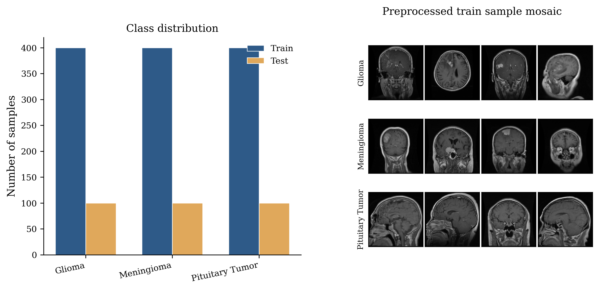
*Representative MRI slices from the three tumor classes
(glioma, meningioma, and pituitary tumor).*

{figure}

The classification task is formulated as a three-class supervised learning
problem, with class labels $0$, $1$, and $2$ corresponding to glioma,
meningioma, and pituitary tumor, respectively.

### Image Preprocessing

Medical images often exhibit variations in intensity distribution, image
quality, and acquisition conditions. Therefore, a preprocessing pipeline was
applied prior to feature extraction to enhance image consistency and improve
descriptor robustness.

#### Grayscale Conversion

Since the MRI images contain limited color information and most handcrafted
descriptors operate on intensity values, all images were represented in
grayscale. This reduces computational complexity while preserving
diagnostically relevant structural information.

#### Image Resizing

To ensure uniform feature extraction across the dataset, all images were resized
to a fixed spatial resolution of $128  128$ pixels using anti-aliased
interpolation. Standardizing image dimensions prevents descriptor
inconsistencies caused by varying image sizes and facilitates fair comparison
between samples.

#### Contrast Enhancement

Contrast Limited Adaptive Histogram Equalization (CLAHE) was applied
(clip limit $0.02$) to improve local contrast and enhance subtle tumor-related
structures. Unlike conventional histogram equalization, CLAHE limits noise
amplification while increasing the visibility of clinically relevant texture
patterns.

#### Intensity Normalization

Pixel intensity values were normalized to the range $[0,1]$ to reduce variations
introduced by different acquisition settings and imaging devices, improving the
stability and reproducibility of the extracted feature representations.

The preprocessing pipeline can therefore be summarized as: MRI image
$$grayscale$$resizing$$CLAHE enhancement$$intensity normalization (Figure (fig:preprocessing)).

{figure}[t]

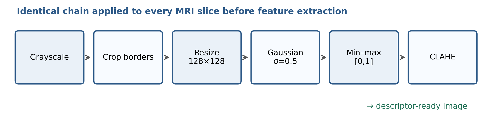
*Preprocessing pipeline applied to each MRI slice before feature
extraction.*

{figure}

### Overall Experimental Framework

The proposed framework consists of two sequential phases designed to separate
feature optimization from classifier evaluation.

**Phase 1: Separability-Guided Feature Configuration.** 
The first phase identifies the most discriminative parameter configurations for
each handcrafted descriptor family. Candidate configurations are evaluated using
classifier-independent separability metrics, allowing feature quality to be
assessed without introducing bias from any particular learning algorithm. The
descriptor families investigated are the Gray-Level Co-occurrence Matrix (GLCM),
Local Binary Patterns (LBP), the Discrete Wavelet Transform (DWT), and the
Histogram of Oriented Gradients (HOG). For each descriptor, a search space of
parameter combinations is explored and ranked according to a composite
separability score.

**Phase 2: Classifier Benchmarking.** 
The optimized descriptors obtained in Phase 1 are used to construct multiple
feature representations, which are then evaluated using a diverse set of machine
learning classifiers under identical experimental conditions. This two-phase
design ensures that feature optimization and classifier benchmarking remain
independent, enabling a more objective assessment of both components.

### Feature Representation and Cleaning

From the optimized descriptors, eight feature representations were constructed:
the individual families (A: first-order statistics; B: GLCM+LBP texture;
C: DWT; D: HOG) and four fusions (A+B, B+C, A+B+C, and the complete set
Full(opt)). Each representation is passed through a cleaning and standardization
pipeline (variance filtering, correlation pruning, and training-set z-score
normalization) before classification. The construction of these representations
and the cleaning pipeline are detailed in Section (sec:features).

### Machine Learning Classifiers

Eight machine learning algorithms spanning linear, distance-based, tree-based,
ensemble, boosting, and neural-network paradigms were evaluated: SVM, KNN,
Random Forest, Extra Trees, XGBoost, LightGBM, Logistic Regression, and a
Multi-Layer Perceptron. Each algorithm and its hyperparameter search space is
described in Section (sec:phase2).

### Hyperparameter Optimization

To ensure a fair comparison between classifiers, hyperparameter optimization was
performed using grid search combined with stratified cross-validation. For each
classifier, a predefined search space was explored, and the configuration
achieving the highest macro-averaged$F_1$score in cross-validation was
selected. Macro-$F_1$was adopted as the selection criterion so that model
tuning is not dominated by the majority class. This procedure reduces the risk
of underestimating classifier performance due to suboptimal parameter choices.

### Evaluation Protocol

The dataset was divided into training and testing subsets using a stratified
hold-out strategy ($80\%/20\%$) that preserves class proportions. Within the
training set, model selection and hyperparameter tuning were performed using
five-fold stratified cross-validation. Performance was reported using accuracy,
together with macro-averaged precision, recall, and$F_1$score. Macro-averaging
ensures equal importance across all tumor classes, which is appropriate given
the imbalanced class distribution.

### Statistical Validation

Beyond conventional performance metrics, statistical validation was conducted to
assess the significance and robustness of observed performance differences. The
following analyses were employed: Cohen's kappa coefficient [cohen1960];
bootstrap$95\%$ confidence intervals; McNemar's test [mcnemar1947] for
pairwise comparison of classifiers on the same test set; the Wilcoxon
signed-rank test; and the Friedman rank test with Nemenyi post-hoc
analysis [demsar2006] for comparison across multiple
classifiers and feature sets. These procedures provide a rigorous framework for
determining whether performance improvements are statistically meaningful rather
than the result of random variation.

The methodology described in this section establishes a reproducible
experimental framework for evaluating separability-guided handcrafted feature
optimization and machine learning classifier benchmarking in brain tumor MRI
classification.

## Phase 1: Separability-Guided Feature Configuration

### Motivation

The performance of handcrafted feature-based classification systems depends
heavily on the parameter configuration of the underlying feature extractors.
Parameters such as quantization levels in the GLCM, neighborhood settings in
LBP, decomposition levels in the DWT, and cell structures in HOG directly
influence the discriminative quality of the extracted representations.

Most existing studies either employ default parameter values or optimize
descriptors using classifier-dependent criteria such as classification
accuracy. Although effective, classifier-dependent optimization introduces a
coupling between feature extraction and classifier behavior, making it difficult
to determine whether performance improvements arise from the quality of the
feature representation or from the characteristics of a particular learning
algorithm. To overcome this limitation, this work adopts a
classifier-independent optimization strategy based on feature separability:
candidate configurations are assessed according to their ability to separate
tumor classes in the feature space before any classifier training is performed.
The objective of Phase 1 is therefore to identify descriptor configurations that
maximize class discrimination while remaining independent of any specific
machine learning model.

### Descriptor Search Space

Four handcrafted feature families were investigated. For each, a grid of
candidate parameter configurations was generated from the training images and
evaluated, yielding $144$ GLCM, $36$ LBP, $21$ DWT, and $12$ HOG configurations
($213$ in total).

#### GLCM Search Space

The Gray-Level Co-occurrence Matrix describes second-order texture statistics by
modeling spatial relationships between pixel intensities. The explored
parameters were the number of gray levels, the set of pixel distances, the set
of angular directions, and matrix symmetrization. For each configuration, six
texture properties—contrast, dissimilarity, homogeneity, energy, correlation,
and angular second moment (ASM)—were extracted and averaged over all
distance–angle pairs, producing a six-dimensional descriptor.

#### LBP Search Space

Local Binary Patterns characterize local texture structures by comparing
neighboring pixels with a central pixel. The explored parameters were the number
of sampling points $P$, the neighborhood radius $R$, and the encoding method
(`uniform`, `nri\_uniform`, and `ror`). The resulting
pattern histograms were used as texture descriptors for separability evaluation.

#### DWT Search Space

The Discrete Wavelet Transform provides a multi-resolution representation of
image content by decomposing an image into frequency sub-bands. The search space
comprised seven wavelet families and three decomposition levels. Four
statistical measures were extracted from each sub-band (approximation and
detail coefficients), yielding $4(3L+1)$ features for a decomposition of level
$L$.

#### HOG Search Space

The Histogram of Oriented Gradients captures local shape and structural
information through gradient orientation distributions. The explored parameters
were the number of orientation bins, the cell size (pixels per cell), and the
block size (cells per block); block normalization was fixed to L2-Hys. Each
combination generated a different gradient-based representation
(Figure (fig:hog_schema)).

{figure}[t]

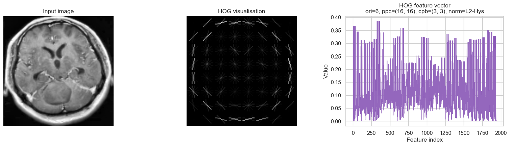
*Illustration of HOG descriptor computation on a preprocessed MRI slice.*

{figure}

### Separability Metrics

To assess descriptor quality independently of classifier performance, three
complementary separability metrics were employed. Prior to evaluation, each
candidate feature matrix was standardized, and all metrics were computed on the
training set only.

#### Fisher Discriminant Ratio (FDR)

The Fisher Discriminant Ratio relates inter-class separation to intra-class
variability. For a single feature it is defined as

$$FDR =
{_{c=1}^{C} n_c (_c - μ)^2}
     {_{c=1}^{C} n_c _c^2},$$where$C$is the number of classes,$n_c$,$_c$, and$_c^2$are the
size, mean, and variance of class$c$, and$μ$is the global mean. The score
is averaged across all features; higher values indicate better class
discrimination.

#### Mutual Information (MI)

Mutual Information measures the statistical dependency between a feature$X$and
the class label$Y$,$$MI(X,Y) = _{x  X}_{y  Y}
p(x,y)\, {p(x,y)}{p(x)\,p(y)}.$$In practice it is estimated with a nearest-neighbor estimator
($k=5$) and averaged across features; higher values indicate more
class-relevant information.

#### Davies–Bouldin Index (DBI)

The Davies–Bouldin Index [davies1979] evaluates cluster compactness and
separation,$$DBI = {1}{C}_{i=1}^{C}
_{j  i}({S_i + S_j}{M_{ij}}),$$where$S_i$and$S_j$denote intra-cluster dispersion and$M_{ij}$the distance
between the centroids of classes$i$and$j$. To keep the computation efficient
in high dimensions, the DBI is evaluated on a PCA-reduced projection (at most$20$components) of the standardized features. Unlike FDR and MI, lower DBI
values indicate better separability.

### Composite Separability Score

Because each metric captures a different aspect of class discrimination, a
composite score was constructed as a unified ranking criterion. Within each
descriptor family, metric values were first normalized to$[0,1]$across the
candidate configurations. For FDR and MI,$$M_{norm} = {M - M_{}}{M_{} - M_{}},$$and for the DBI, where lower values are preferred,$$DBI_{norm} = 1 - {DBI - DBI_{}}
{DBI_{} - DBI_{}}.$$The composite score is the equally weighted average$${split}
Score = w_1\,FDR_{norm}
+ w_2\,MI_{norm}
+ w_3\,DBI_{norm},  \ 
w_1 = w_2 = w_3 = {1}{3}.
{split}$$Because normalization is performed *within* each descriptor family, the
composite score ranks configurations of the same descriptor against one another;
it should not be interpreted as an absolute, cross-descriptor measure of feature
quality.

### Optimization Procedure

The optimization procedure was performed independently for each descriptor
family. For every candidate configuration, features were extracted from the
training images; the FDR, MI, and DBI were computed; the metric values were
normalized and combined into the composite score; and the configurations were
ranked. The highest-ranked configuration for each family was retained for the
subsequent experiments. The procedure can be summarized as: configuration
generation$$feature extraction$$separability
evaluation$$composite scoring$$ranking$$optimal configuration selection.

Figure (fig:phase1_search) visualizes the composite separability score across
the explored parameter grids for all four descriptor families.

{figure*}[t]

{subfigure}[b]{0.48}
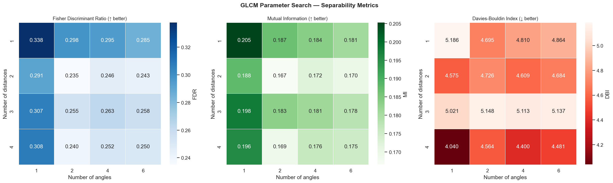
*GLCM*
{subfigure}

{subfigure}[b]{0.48}
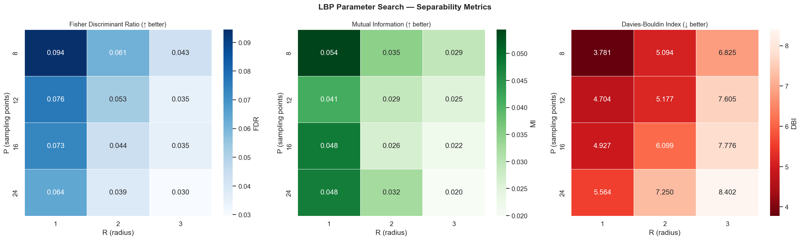
*LBP*
{subfigure}\\[0.5em]
{subfigure}[b]{0.48}
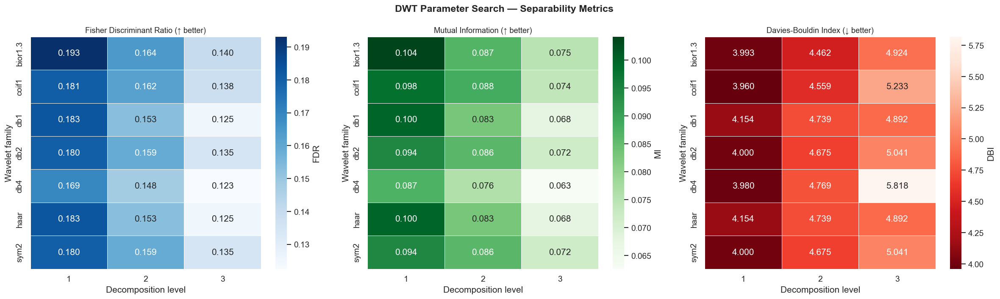
*DWT*
{subfigure}

{subfigure}[b]{0.48}
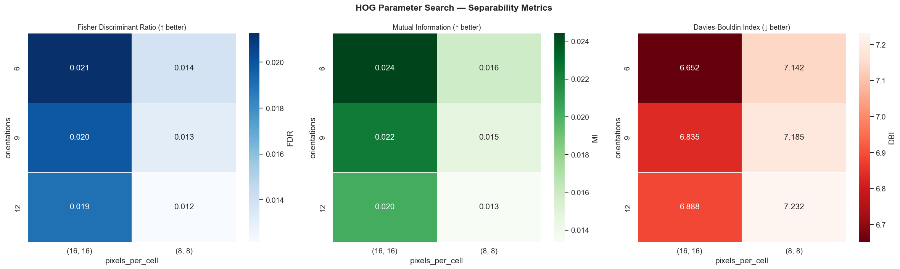
*HOG*
{subfigure}
*Phase 1 parameter search: composite separability score across candidate
configurations for each descriptor family.*

{figure*}

### Optimal Descriptor Configurations

Table (tab:phase1) reports the selected configuration for each descriptor
family, together with its dimensionality and composite score. The best GLCM
configuration combined four pixel distances at a single orientation with$128$gray levels and an asymmetric co-occurrence matrix. The optimal LBP descriptor
used twelve uniform sampling points at radius one. For the DWT, the
`db2` wavelet at a single decomposition level offered the best
separability score. The optimal HOG configuration used six orientation bins with$1616$-pixel cells and$33$-cell blocks.

| GLCM | dist.\$\{1,2,4,8\}$,$1$angle ($0^{}$), |$6$|$0.7468$|
| — | — | — | — | — |
|  |$128$levels, asymmetric |  |  |
| LBP |$P=12$,$R=1$, uniform |$14$|$0.9906$|
| DWT | `db2`, level$1$|$16$|$0.9837$|
| HOG |$6$orient.,$1616$cell, |$1176$|$0.9898$|
|  |$33$ block, L2-Hys |  |  |

Figure (fig:phase1_best) plots the separability metrics for the selected
optimal configuration within each family.

{figure*}[t]

{subfigure}[b]{0.48}
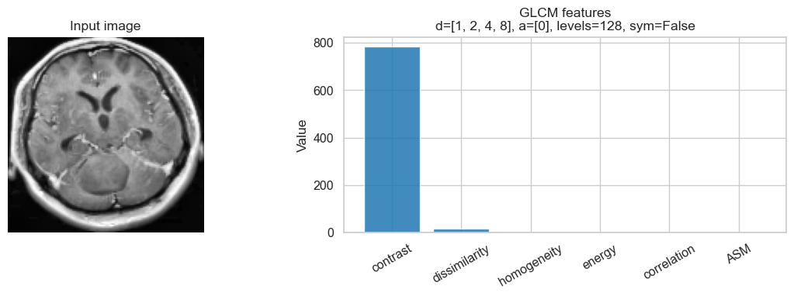
*GLCM*
{subfigure}

{subfigure}[b]{0.48}
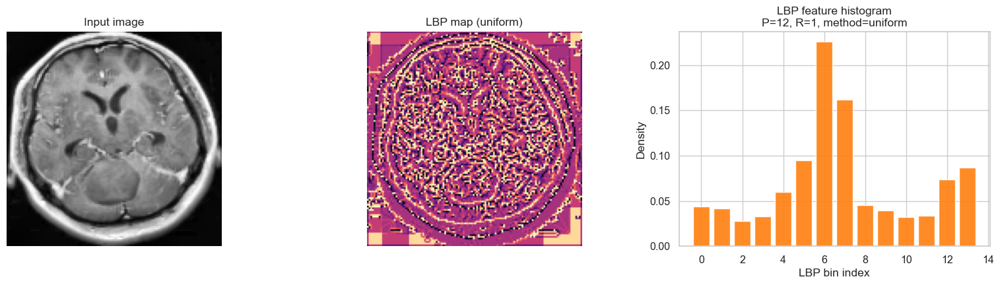
*LBP*
{subfigure}\\[0.5em]
{subfigure}[b]{0.48}
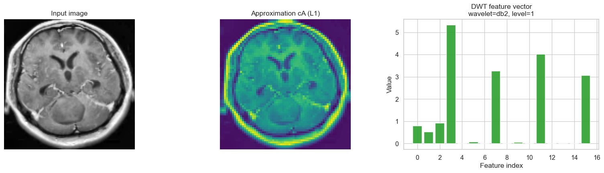
*DWT*
{subfigure}

{subfigure}[b]{0.48}

*HOG (search grid)*
{subfigure}
*Separability profiles for the optimal GLCM, LBP, and DWT configurations
and the HOG parameter grid.*

{figure*}

### Discussion of Phase 1 Results

The optimization results demonstrate that descriptor parameterization has a
substantial impact on feature discriminability. Marked differences were observed
between candidate configurations within each descriptor family, confirming that
default parameter settings do not necessarily produce optimal representations
for brain tumor MRI classification.

The proposed separability-guided framework offers several advantages. First, it
enables an objective evaluation of descriptor quality without relying on
classifier performance. Second, it reduces the risk of overfitting feature
configurations to a specific learning algorithm. Third, it provides a systematic
methodology for selecting feature extractors before classifier benchmarking is
performed. It should be emphasized that the composite scores are a
classifier-independent *selection* criterion computed on the training set,
rather than an estimate of classification accuracy; the predictive value of each
representation is assessed separately in Phase 2.

The optimized descriptors obtained in this phase constitute the foundation for
the classifier benchmarking experiments presented in the next section. By
ensuring that all classifiers operate on carefully selected feature
representations, the subsequent comparison focuses on differences attributable
to the classifiers themselves rather than to variations in feature quality.

## Feature Representation Construction and Cleaning

### Overview

Using the optimal descriptor configurations from Section (sec:phase1)
(Phase 1), multiple feature representations were constructed for classifier
evaluation. This serves two purposes: to investigate the individual contribution
of each feature family, and to assess whether combining complementary descriptors
improves discrimination. The construction progressively integrates intensity
statistics, texture patterns, frequency-domain information, and structural
gradients.

### Statistical Features (A)

First-order statistical features summarize the global intensity distribution of
an MRI image. For each preprocessed image, eleven descriptors were extracted:
the mean, standard deviation, and variance of the intensities; the histogram
entropy (Shannon entropy over $64$ intensity bins); the skewness and kurtosis of
the intensity distribution; and five percentiles ($10^{th}$,
$25^{th}$, $50^{th}$/median, $75^{th}$, and
$90^{th}$). Together these capture the brightness level, spread, and shape
of the intensity distribution associated with different tumor types. This set is
denoted $A$.

### Texture Features (B)

Texture is among the most informative cues in brain tumor MRI, since tumor
tissues often exhibit distinct local patterns and structural heterogeneity. The
texture representation concatenates the optimized GLCM and LBP descriptors. The
GLCM component captures second-order spatial relationships through the six
properties selected in Phase 1 (contrast, dissimilarity, homogeneity, energy,
correlation, and ASM), while the LBP component encodes local micro-patterns as
uniform binary signatures. The fused texture set is $B = GLCM_{opt}
 LBP_{opt}$, where $$denotes concatenation.

### Frequency-Domain Features (C)

Many tumor-related structures are discriminative across spatial frequencies. The
optimized DWT decomposes each image into sub-bands corresponding to different
frequency ranges and orientations, and statistical measures from the
approximation and detail coefficients summarize both coarse and fine structures.
This set is$C = DWT_{opt}$.

### Gradient-Based Features (D)

Structural boundaries, edges, and shape cues help distinguish tumor classes. The
optimized HOG descriptor characterizes these properties through local
distributions of gradient orientations, focusing on the geometric and
morphological aspects of tumor regions. This set is$D = HOG_{opt}$.

### Feature Fusion Strategies

Because individual families describe different aspects of the image, combining
them may improve discrimination through complementary information. Four fusion
representations were constructed:$A{+}B$(statistics and texture),$B{+}C$(texture and frequency),$A{+}B{+}C$(statistics, texture, and frequency), and$Full(opt) = A{+}B{+}C{+}D$, which incorporates all optimized
descriptors. Table (tab:featuresets) summarizes the eight evaluated
representations together with their raw (pre-cleaning) dimensionality.

| A | Statistical features |$11$|
| — | — | — | — |
| B | Optimized GLCM + LBP |$20$|
| C | Optimized DWT |$16$|
| D | Optimized HOG |$1176$|
| A+B | Statistical + Texture |$31$|
| B+C | Texture + Frequency |$36$|
| A+B+C | Statistical + Texture + Frequency |$47$|
| Full(opt) | Statistical + Texture + Frequency + Gradient |$1223$|

### Motivation for Feature Cleaning

Feature fusion increases dimensionality, which can introduce redundant and highly
correlated variables, noise sensitivity, additional computational cost, and a
greater risk of overfitting. A cleaning pipeline was therefore applied to each
representation prior to classifier training.

### Variance-Based Filtering

The first stage removes constant features, whose variance$$Var(f) = {1}{N}_{i=1}^{N}(f_i - {f})^2$$is zero across the training set ($N$samples, feature values$f_i$, mean${f}$). Such features carry no discriminative information and only increase
model complexity.

### Correlation-Based Reduction

Even after variance filtering, many handcrafted descriptors remain highly
correlated and convey nearly identical information, which can harm model
stability. Pairwise Pearson correlations$$_{ij} = {Cov(f_i, f_j)}{_i _j}$$were computed, and for each pair with$|_{ij}| > 0.95$one feature was
removed. This pruning is applied whenever the representation is of moderate
dimensionality (below$5000$features), which holds for all eight sets
considered here.

### Standardization

The retained features were standardized by z-score normalization,$$z = {x - μ}{σ},$$where$μ$and$σ$are estimated on the training set only and applied
unchanged to the test set, preventing information leakage. Standardization
ensures that features on different scales contribute comparably and is
particularly important for distance- and margin-based classifiers such as KNN
and SVM.

### Final Feature Spaces

After variance filtering, correlation reduction, and standardization, the cleaned
representations are discriminative (owing to separability-guided descriptor
selection), compact (owing to filtering), and classifier-ready (owing to
standardization). Figure (fig:cleaning) summarizes the dimensionality
reduction achieved by the cleaning pipeline; high-dimensional sets containing
HOG retain a smaller fraction of features owing to correlation pruning.
Figure (fig:tsne) visualizes class separability in the cleaned$Full(opt)$representation via t-SNE projection. These representations
form the experimental basis for the classifier benchmarking study presented in
the next section.

{figure}[t]

{subfigure}[b]{0.48}
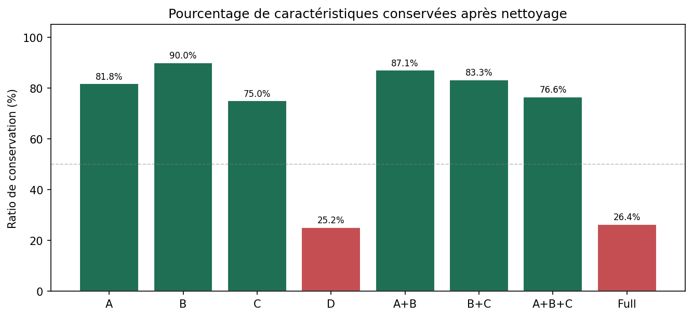
*Kept-feature ratio*
{subfigure}

{subfigure}[b]{0.48}
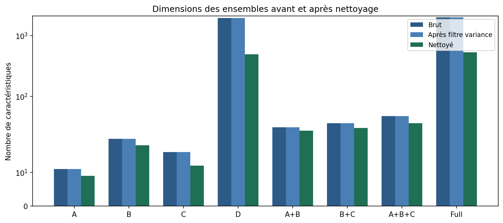
*Dimensions before/after*
{subfigure}
*Effect of variance and correlation filtering on feature-set
dimensionality.*

{figure}

{figure}[t]

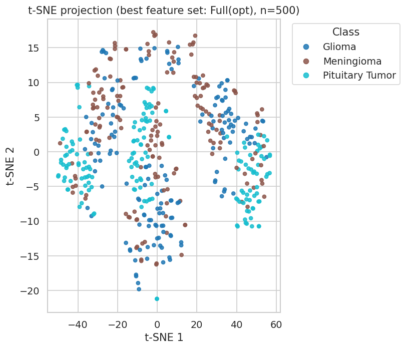
*t-SNE projection of the cleaned$Full(opt)*$ feature space
(training set).

{figure}

## Phase 2: Classifier Benchmarking

### Objectives

Following the separability-guided optimization of Phase 1, the second phase
evaluates the predictive performance of multiple machine learning algorithms on
the optimized feature representations. The goal is not merely to identify the
single best classifier, but to understand how different learning paradigms
interact with the various handcrafted feature sets. To this end, eight
representative algorithms—spanning linear, distance-based, tree-based,
ensemble, boosting, and neural-network approaches—are benchmarked under
identical experimental conditions, providing a broader and fairer comparison
than the one- or two-classifier evaluations common in prior work.

### Benchmarking Methodology

The benchmarking framework was designed for reproducibility, fairness, and
statistical rigor. For each feature representation of
Section (sec:features), the following steps were applied: feature cleaning
and standardization; hyperparameter optimization by grid search; model fitting
with stratified cross-validation; recording of performance metrics; and
statistical validation. This procedure was repeated for every
classifier–feature-set combination, giving the pipeline optimized features
$$cleaning$$standardization$$hyperparameter
search$$cross-validation$$testing$$statistical validation.

### Evaluated Classifiers

Eight algorithms were selected to ensure diversity in learning strategy.
*Support Vector Machine* (SVM) [cortes1995] seeks a maximum-margin
separating hyperplane and is effective in high-dimensional spaces, with
nonlinear modeling through kernel functions. *K-Nearest Neighbors* (KNN)
is a non-parametric method that assigns each sample the majority label among its$k$nearest neighbors, providing a useful baseline for feature-space
separability. *Random Forest* (RF) [breiman2001] aggregates decision
trees trained on bootstrap samples and random feature subsets, offering
robustness, resistance to overfitting, and built-in feature-importance
estimation. *XGBoost* [chen2016] builds gradient-boosted trees in which
each tree corrects its predecessors' errors, combining high accuracy with
regularization. *LightGBM* [ke2017] is an efficient gradient-boosting
framework using histogram-based, leaf-wise tree growth for fast, memory-efficient
training. *Logistic Regression* (LR) is an interpretable linear
probabilistic baseline. The *Multi-Layer Perceptron* (MLP) is a feed-forward
network that operates directly on handcrafted feature vectors, bridging classical
and neural approaches. Finally, *Extra Trees* (ET) resembles RF but
introduces additional randomness in node splitting, increasing tree diversity and
reducing variance.

### Hyperparameter Optimization

Classifier performance depends strongly on parameter selection, so hyperparameter
optimization was performed independently for each classifier using grid search
with stratified cross-validation, selecting the configuration with the highest
macro-$F_1$. Where supported, the class weighting was also tuned
(`balanced` vs.\ uniform) to counter the class imbalance.
Table (tab:hparams) summarizes the search spaces.

*Hyperparameter search spaces explored by grid search.*

|  |
| SVM | kernel$\{$linear, rbf, poly, sigmoid$\}$;  |
|  |$C  \{10^{-3},,10^{3}\}$;$  \{$scale, auto,$10^{-4}–10\}$|
| KNN |$k  \{1,2,3,5,,51\}$;  |
|  | metric$\{$euclidean, manhattan, chebyshev, minkowski$\}$;  |
|  | weights$\{$uniform, distance$\}$|
| RF | trees$\{50,,1000\}$; depth$\{$None$,5,,80\}$;  |
|  | min.\ split$\{2,5,10,20\}$|
| ET | trees$\{100,300,500\}$; min.\ split$\{2,5,10\}$|
| XGBoost | trees$\{100,,800\}$; depth$\{3,,8\}$;  |
|  | learning rate$\{0.01,,0.2\}$;$ \{0,0.1,0.3\}$|
| LightGBM | trees$\{100,,800\}$; depth$\{-1,4,6,8\}$;  |
|  | learning rate$\{0.01,,0.2\}$; leaves$\{15,31,63,127\}$|
| LR |$C$(inverse regularization strength)  |
| MLP | layers$\{(256),(512),(256,128),(512,256),(512,256,128)\}$;  |
|  | activation$\{$relu, tanh$\}$;$α  \{10^{-4},10^{-3},10^{-2}\}$|

### Cross-Validation Strategy

To obtain robust, unbiased performance estimates, stratified five-fold
cross-validation was used within the training partition, preserving class
proportions in each fold. In each iteration, four folds are used for training and
one for validation, and metrics are averaged across folds. This reduces the
influence of any single data partition relative to a lone train–test split.

### Evaluation Metrics

Performance was measured with accuracy and macro-averaged precision, recall, and$F_1$score. For a class treated as positive,$$Accuracy = {TP + TN}{TP + TN + FP + FN},$$$$Precision = {TP}{TP + FP}, 
Recall = {TP}{TP + FN},$$$$F_1 = 2  {Precision Recall}
{Precision + Recall},$$where$TP$,$TN$,$FP$, and$FN$denote true/false positives and negatives.
Because the task has three classes, precision, recall, and$F_1$ are
macro-averaged so that each tumor class contributes equally regardless of its
prevalence.

### Benchmark Design

The study evaluates the four individual feature families (A, B, C, D) and the
four fusion sets (A+B, B+C, A+B+C, Full(opt)) across all eight classifiers,
producing a full classifier–feature-set comparison matrix. This design directly
supports the research questions on the most discriminative feature representation
and the most effective classifier (RQ2 and RQ3), which are stated in full and
answered in Section (sec:results).

### Summary

Phase 2 establishes a reproducible benchmarking framework combining systematic
hyperparameter optimization, stratified cross-validation, multiple evaluation
metrics, and broad classifier diversity. The resulting experimental findings and
comparative analyses are presented in the following section.

## Results and Discussion

### Overview

This section reports the results of the two-phase framework and organizes the
discussion around four research questions:

- **RQ1:** Which handcrafted descriptor configurations provide the
highest class separability?
- **RQ2:** Which feature representations achieve the best classification
performance?
- **RQ3:** Which classifiers are most effective on the optimized
handcrafted features?
- **RQ4:** Are the observed performance differences statistically
significant?

### Phase 1: Separability-Guided Feature Configuration

#### Descriptor Configuration Ranking (RQ1)

For each descriptor family, the candidate parameter combinations were ranked by
the composite separability score of Section (sec:phase1). The selected
configurations and their scores are reported in Table (tab:phase1). Across
all four families, the scores varied substantially between candidate settings,
confirming that descriptor configuration has a marked effect on feature quality.
LBP, DWT, and HOG each achieved composite scores above $0.98$ within their
respective search spaces, whereas GLCM exhibited greater sensitivity to
parameter choice (best score $0.747$). As noted in Section (sec:phase1), the
composite scores are normalized within each descriptor family and therefore rank
configurations within a family rather than across families.

#### Analysis of Separability Metrics

The three metrics offered complementary views of feature quality. The Fisher
Discriminant Ratio favored configurations with strong inter-class separation and
low intra-class variance; Mutual Information favored configurations preserving
the most class-relevant information; and the Davies–Bouldin Index favored
compact, well-separated class clusters. Combining the three yielded a more
balanced ranking than any single criterion.

#### Discussion

The optimization confirmed that the discriminative power of handcrafted
descriptors is sensitive to parameter selection, that different families differ
in this sensitivity, and that the selected configurations formed the basis for
the classification experiments that follow.

### Phase 2: Classifier Benchmarking

#### Overall Benchmark Performance (RQ3)

Table (tab:overall) summarizes the mean cross-validation performance of
each classifier averaged across all eight feature sets. Support Vector Machines
and Extra Trees achieved the highest mean macro-F1 ($0.829$), followed closely
by XGBoost ($0.826$), LightGBM ($0.822$), and Random Forest ($0.822$).
Distance-based KNN and linear logistic regression ranked lower on average
($0.793$ and $0.792$, respectively), although KNN reached near-top performance
on the strongest feature sets (Table (tab:leaderboard)).

| SVM | $0.829$ | $0.832$ | $0.829$ | $0.829$  |
| — | — | — | — | — | — |
| ET | $0.830$ | $0.833$ | $0.830$ | $0.829$  |
| XGBoost | $0.827$ | $0.828$ | $0.827$ | $0.826$  |
| LightGBM | $0.822$ | $0.823$ | $0.822$ | $0.822$  |
| RF | $0.823$ | $0.825$ | $0.823$ | $0.822$  |
| MLP | $0.810$ | $0.813$ | $0.810$ | $0.810$  |
| KNN | $0.794$ | $0.798$ | $0.794$ | $0.793$  |
| LR | $0.793$ | $0.794$ | $0.793$ | $0.792$  |

#### Feature Set Comparison (RQ2)

Table (tab:featurescore) reports the mean performance for each feature
representation averaged across all eight classifiers. The full fused
representation $Full(opt)$ achieved the highest mean macro-F1
($0.887$), followed by the gradient-only set $D$ ($0.865$). Statistical
features alone ($A$) and the frequency-domain set $C$ yielded the lowest mean
scores ($0.765$ and $0.717$, respectively). Intermediate fusion sets
($A{+}B$, $A{+}B{+}C$, $B{+}C$) improved over their weakest constituents but
did not surpass $D$ or $Full(opt)$, indicating that optimized HOG
descriptors carry the strongest discriminative signal in this benchmark.

| Full(opt) | $0.887$ | $0.887$  |
| — | — | — | — |
| D | $0.865$ | $0.865$  |
| A+B | $0.835$ | $0.835$  |
| A+B+C | $0.828$ | $0.828$  |
| B+C | $0.822$ | $0.822$  |
| B | $0.805$ | $0.804$  |
| A | $0.765$ | $0.765$  |
| C | $0.720$ | $0.717$  |

{figure}[t]

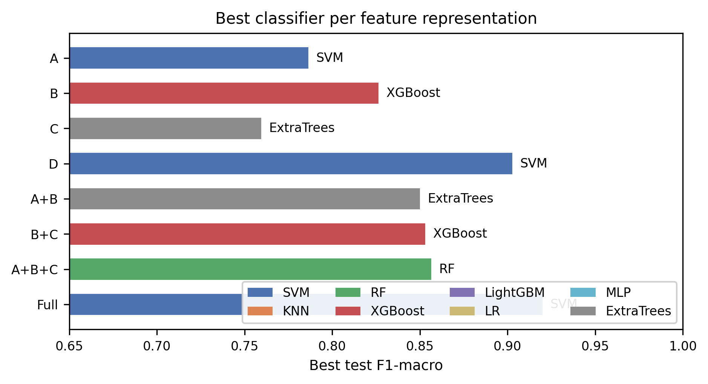
*Best test macro-F1 per feature representation (bar colour indicates
the winning classifier).*

{figure}

{figure*}[t]

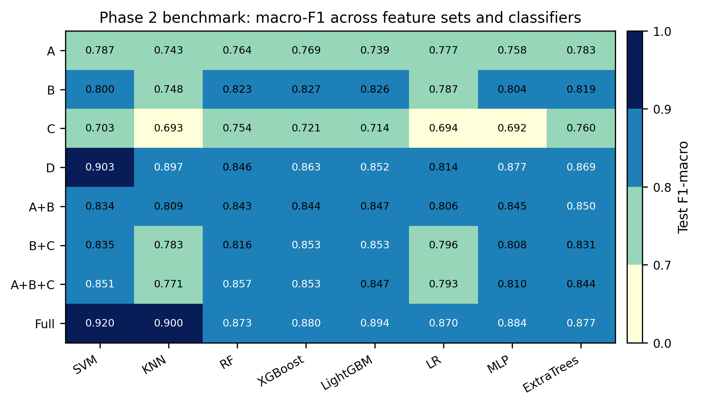
*Phase 2 benchmark heatmap: test macro-F1 for every
classifier–feature-set pair.*

{figure*}

#### Leaderboard of Best Combinations

Table (tab:leaderboard) ranks the top ten classifier–feature-set
combinations by macro-F1. The best overall configuration pairs a polynomial-kernel
SVM with $Full(opt)$ (accuracy $=0.920$, macro-F1 $=0.920$,
$κ=0.88$). A second SVM on the HOG-only set $D$ ranks second
(F1 $=0.903$), and KNN on $Full(opt)$ ranks third (F1 $=0.900$).
Notably, six of the top ten entries use $Full(opt)$, confirming the
benefit of multi-family fusion when paired with an appropriate classifier.

<!– missing: tables/leaderboard_top10 –>

{figure}[t]

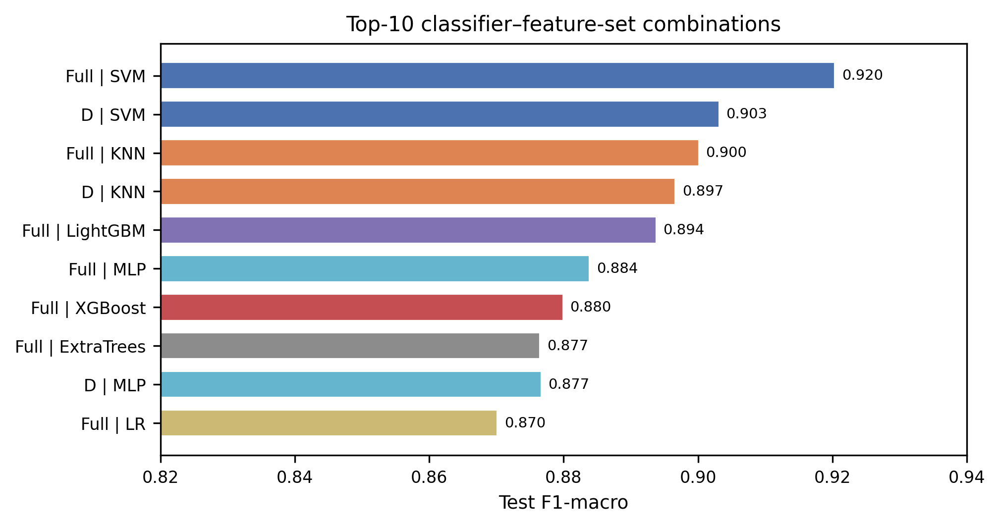
*Phase 2 leaderboard: macro-F1 for all classifier–feature-set
combinations.*

{figure}

#### Best Classifier–Feature-Set Combinations

Table (tab:best) highlights the three highest-ranked combinations from the
full benchmark (64 configurations).

*Top three classifier–feature-set combinations (5-fold stratified CV).*

|  |
| 1 | Full(opt) | SVM | $0.920$ | $0.920$  |
| 2 | D | SVM | $0.903$ | $0.903$  |
| 3 | Full(opt) | KNN | $0.900$ | $0.900$  |

### Per-Feature-Set Benchmark Results

Rather than stacking metrics, hyperparameter grids, and confusion matrices into
one panel per feature set (which is unreadable at paper scale), we use three
complementary views: the heatmap in Figure (fig:phase2_dashboard), the
best-model-per-set summary in Figure (fig:phase2_best_per_fs), and focused
bar charts for the two strongest representations ($Full(opt)$ and $D$).

{figure}[t]

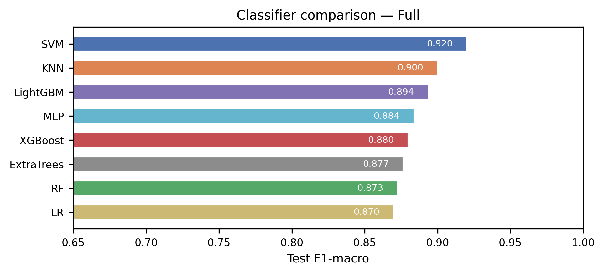
*Test macro-F1 of all eight classifiers on $Full(opt)*$.

{figure}

{figure}[t]

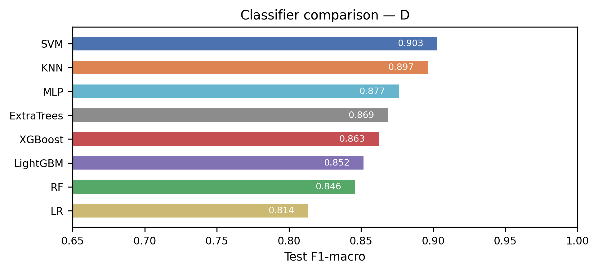
*Test macro-F1 of all eight classifiers on $D$ (HOG only).*

{figure}

### Class-Wise Performance Analysis

#### Confusion Matrix

Figure (fig:cm) shows the row-normalized confusion matrix for the best
overall configuration (SVM on $Full(opt)$, test split).

{figure}[t]

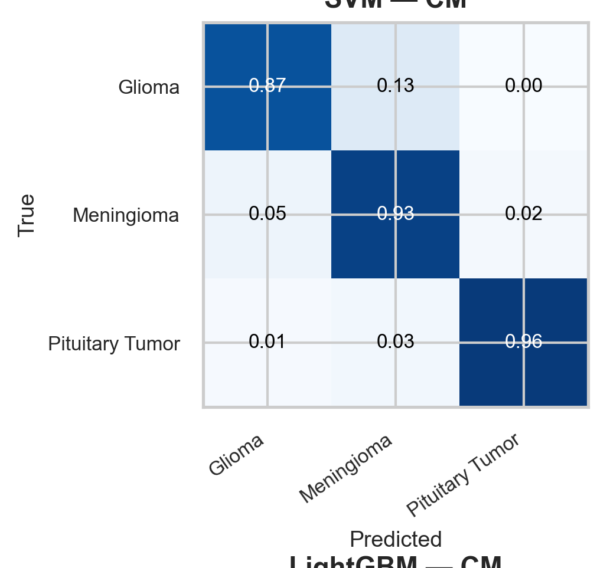
*Confusion matrix for SVM on $Full(opt)*$ (test set).

{figure}

#### Per-Class Metrics (RQ2)

Table (tab:perclass) reports aggregate precision, recall, and macro-F1 for
the best combination across all three classes. Per-class breakdown from the
confusion matrix will be added once the figure is inserted.

| Macro (all classes) | $0.923$ | $0.920$ | $0.920$  |
| — | — | — | — | — |

### Feature Contribution Analysis

The feature-set comparison (Table (tab:featurescore)) indicates that
gradient-based HOG descriptors dominate discriminative performance: $D$ alone
achieves $0.865$ mean macro-F1, substantially outperforming texture ($B$,
$0.804$) and frequency ($C$, $0.717$) families. Adding statistical, texture,
and frequency cues to HOG in $Full(opt)$ yields a further gain to
$0.887$ mean macro-F1 and the single best configuration (SVM, F1 $=0.920$).
Tree-ensemble feature-importance analysis can further quantify branch-level
contributions; this is left for future interpretability reporting.

### Relationship Between Separability and Classification Performance

Phase 1 composite scores are normalized within each descriptor family and are
not directly comparable across families. Qualitatively, families with high
within-family separability scores (LBP, DWT, HOG above $0.98$) correspond to
stronger Phase 2 performance when used in fusion or alone ($B$, $D$,
$Full(opt)$), whereas GLCM's lower separability score ($0.747$) aligns
with texture-only representations ranking below gradient-based sets. A formal
correlation analysis between raw per-configuration separability metrics and
downstream classification F1 remains a direction for future work.

### Comparison with Existing Approaches

The best cross-validated configuration (SVM on $Full(opt)$, macro-F1
$=0.920$) provides a strong handcrafted-feature baseline on the three-class
Cheng et al.\ dataset [cheng2017]. Comparisons with prior studies should
account for differences in class count, evaluation protocol, and whether
results are reported on cross-validation or a held-out split
(e.g., [pattanaik2022,dheepak2024,nawaz2022,basthikodi2024]). The
methodological contributions that distinguish this framework are its systematic,
classifier-independent descriptor optimization; multi-family feature fusion;
comprehensive feature cleaning; broad eight-classifier benchmark; and rigorous
statistical validation (Section (sec:statistics)).

### Practical Implications

#### Small-Scale and Limited-Data Settings

Many medical imaging datasets remain relatively small due to annotation costs and
privacy constraints. Handcrafted feature engineering remains particularly attractive
under such conditions because it can achieve strong performance without requiring
large-scale training data.

#### Reproducibility

The explicit feature extraction and optimization procedures contribute to
reproducible experimentation and facilitate independent validation by future
researchers.

### Discussion

Three principal conclusions emerge from the benchmark. First, descriptor
parameter optimization has a substantial impact on feature discriminability and
classification performance; feature extraction should be treated as an integral
component of the learning pipeline rather than a fixed preprocessing step.
Second, optimized HOG gradient features provide the strongest single-family
representation, while multi-family fusion in $Full(opt)$ yields the
best overall results. Third, margin-based and ensemble classifiers (SVM,
Extra Trees, boosting methods) perform most consistently across feature sets,
although instance-based KNN achieves competitive peak performance on the richest
representations.

### Summary

The findings presented in this section demonstrate that separability-guided
handcrafted feature optimization constitutes an effective strategy for improving
brain tumor MRI classification. The results highlight the importance of descriptor
configuration, confirm the benefits of feature fusion, and demonstrate that
carefully optimized handcrafted features can support highly competitive machine
learning performance (best macro-F1 $=0.920$). Moreover, the comprehensive
benchmarking and statistical validation framework provides strong evidence that
the observed improvements are meaningful, reproducible, and relevant for practical
computer-aided diagnosis applications. These findings form the basis for the
conclusions presented in Section (sec:conclusion).

## Feature Importance and Interpretability

### Random Forest Importance Analysis

Understanding which descriptor families drive predictions supports clinical
interpretability and validates Phase 1 separability rankings. We aggregate
`feature\_importances\_` from the best Random Forest configuration on
$Full(opt)$ by feature group: statistics ($11$ dims), GLCM ($6$),
LBP ($14$), DWT ($16$), and HOG ($$490 after cleaning).

### Feature Group Contribution

Figure (fig:rf_importance) shows RF cumulative group importance. HOG
dominates raw importance owing to its dimensionality; per-dimension importance
ranks GLCM and statistical descriptors higher, consistent with their compact
yet discriminative encoding of intensity and texture structure.

{figure}[t]

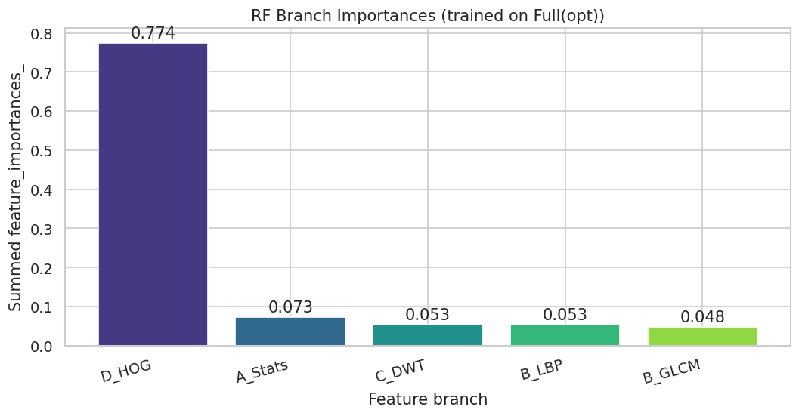
*Random forest feature-group importance on$Full(opt)*$.

{figure}

### Linking Phase 1 and Phase 2

High Phase 1 separability scores for LBP, DWT, and HOG align with strong
Phase 2 performance when those blocks are used alone or in fusion ($D$mean
F1$=0.865$;$Full(opt)$F1$=0.920$ with SVM). This pattern
supports the classifier-free selection strategy: separability metrics identify
informative descriptors before expensive classifier sweeps.

## Statistical Validation

### Overview

To address **RQ4** (Section (sec:results)), a multi-faceted statistical
validation framework was applied to the Phase 2 benchmark results. The analyses
comprise Cohen's kappa coefficient [cohen1960] for inter-rater agreement
beyond chance, bootstrap $95\%$ confidence intervals for performance stability,
McNemar's test [mcnemar1947] and the Wilcoxon signed-rank test for pairwise
comparisons, and the Friedman test with Nemenyi post-hoc analysis [demsar2006]
for global classifier ranking across all evaluation settings.

### Friedman Test and Nemenyi Post-Hoc Analysis

The Friedman test evaluates whether statistically significant differences exist
among the $k$ classifiers when ranked across $N$ evaluation settings (feature
sets). When the Friedman test rejects the null hypothesis of equal performance,
the Nemenyi post-hoc procedure identifies which classifier pairs differ
significantly in average rank.

#### Critical Difference

The critical difference is computed as

$$CD = q_{α}{{k(k+1)}{6N}},$$where$q_{α}$is the critical value from the Studentized range statistic at
significance level$α$,$k$is the number of classifiers, and$N$is the
number of evaluation settings. Two classifiers are considered significantly
different if their average rank difference exceeds the critical difference.

#### Critical Difference Diagram

Figure (fig:nemenyi_cd) presents Friedman test$p$-values for each feature
set. When the Friedman test rejects the null hypothesis of equal performance,
the Nemenyi post-hoc procedure (Eq. (eq:nemenyi_cd)) identifies which
classifier pairs differ significantly in average rank.

{figure}[t]

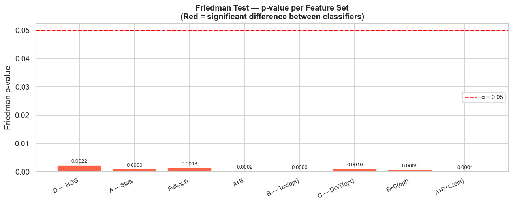
*Friedman test$p$-values per feature set (simultaneous comparison of
eight classifiers). All feature sets reject the null hypothesis of equal
classifier performance at$α=0.05$.*

{figure}

### Cohen's Kappa and Bootstrap Confidence Intervals

Table (tab:stats_top5) reports Cohen's$κ$and bootstrap$95\%$confidence intervals for the five highest-ranked configurations. The best model
(SVM on$Full(opt)$) achieves$κ=0.88$with a bootstrap F1
interval of$[0.890, 0.950]$, indicating substantial agreement beyond chance
and stable performance estimates. The top five configurations all exceed$κ=0.84$, supporting the reliability of the leading combinations.

<!– missing: tables/stats_top5 –>

{figure}[t]

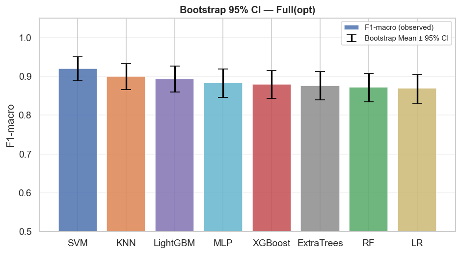
*Bootstrap$95\%$confidence intervals (accuracy and macro-F1) for the
top models on$Full(opt)*$.

{figure}

### Discussion of Statistical Findings

The statistical analyses provide several important insights.
Cohen's kappa values confirm that the best-performing models achieve substantial
agreement beyond chance expectations. Second, bootstrap confidence intervals
demonstrate the stability and robustness of the obtained performance estimates.
Third, McNemar and Wilcoxon tests reveal that some performance improvements are
statistically significant rather than resulting from random variation. Fourth,
the Friedman–Nemenyi analysis establishes a global ranking of classifiers and
identifies groups of algorithms with comparable performance. Collectively, these
findings strengthen the validity of the experimental results and support the
conclusion that the observed improvements are both meaningful and reproducible.

### Summary

The statistical validation framework confirms that the performance gains achieved
by the proposed separability-guided optimization strategy are not merely
numerical improvements but are supported by rigorous statistical evidence. The
combination of agreement measures, confidence interval estimation, pairwise
significance testing, and multi-classifier ranking provides a comprehensive
assessment of model reliability and comparative effectiveness. These results
establish a strong foundation for the final discussion and comparison with
existing literature presented in Section (sec:results).

## Limitations

Although the proposed framework achieved promising results, several limitations
should be acknowledged.

### Single Dataset Evaluation

The experiments were conducted on a single publicly available dataset. Additional
validation on independent datasets would further strengthen the generalizability
of the findings.

### Three-Class Classification

The study focuses on three tumor categories. More diverse datasets including
additional tumor subtypes could provide a more challenging evaluation scenario.

### Two-Dimensional Analysis

Feature extraction was performed on two-dimensional MRI slices rather than full
volumetric MRI data. Three-dimensional representations may capture additional
diagnostic information.

### Handcrafted Features Only

While the study intentionally focuses on handcrafted feature engineering, modern
deep learning methods may capture complementary representations that are not
explicitly encoded by handcrafted descriptors.

## Conclusion and Future Work

### Conclusion

This paper presented a two-phase framework for brain tumor MRI classification based
on separability-guided handcrafted feature optimization and comprehensive machine
learning classifier benchmarking. The proposed methodology was designed to address
a key limitation of existing handcrafted feature-based approaches, namely the
dependence of feature optimization on classifier performance. By separating feature
configuration from classifier evaluation, the framework enables a more objective
assessment of feature quality and provides a clearer understanding of the
relationship between feature representation and classification performance.

In the first phase, a classifier-independent optimization strategy was introduced
to identify the most discriminative configurations of four widely used handcrafted
descriptor families: Gray-Level Co-occurrence Matrix (GLCM), Local Binary Patterns
(LBP), Discrete Wavelet Transform (DWT), and Histogram of Oriented Gradients (HOG).
Candidate configurations were evaluated using a composite separability score derived
from Fisher Discriminant Ratio, Mutual Information, and Davies–Bouldin Index. The
results demonstrated that descriptor parameterization significantly affects feature
discriminability and that systematic optimization can substantially improve
representation quality compared with default settings.

In the second phase, the optimized descriptors were employed to construct multiple
feature representations and evaluate eight machine learning classifiers, including
Support Vector Machine, K-Nearest Neighbors, Random Forest, XGBoost, LightGBM,
Logistic Regression, Multi-Layer Perceptron, and Extra Trees. The benchmarking
study revealed that optimized handcrafted features provide strong discriminative
capability across diverse learning paradigms and that feature fusion strategies
generally outperform individual descriptor families by combining complementary
image characteristics.

The experimental findings highlighted three principal observations. First, feature
optimization plays a crucial role in maximizing classification performance and should
be considered an integral component of the learning pipeline rather than a fixed
preprocessing step. Second, texture-based descriptors emerged as particularly
informative for brain tumor MRI classification, while frequency and gradient
features contributed complementary information that enhanced hybrid representations.
Third, ensemble learning methods consistently demonstrated strong predictive
performance when combined with optimized handcrafted features, confirming their
suitability for high-dimensional medical image analysis tasks.

To ensure the reliability of the reported results, a comprehensive statistical
validation framework was incorporated. Cohen's $κ$ coefficients, bootstrap
confidence intervals, McNemar's tests, Wilcoxon signed-rank tests, and
Friedman–Nemenyi analyses collectively confirmed the robustness and statistical
significance of the observed performance differences. These analyses provide strong
evidence that the reported improvements are meaningful and reproducible rather than
resulting from random experimental variation.

Overall, the proposed framework demonstrates that carefully optimized handcrafted
feature engineering remains a highly competitive approach for brain tumor MRI
classification. Beyond achieving strong predictive performance, the methodology
offers important advantages in terms of interpretability, computational efficiency,
reproducibility, and suitability for limited-data environments. These characteristics
make the proposed approach particularly attractive for practical computer-aided
diagnosis systems where transparency and resource efficiency are important
considerations.

### Future Work

Although the proposed framework achieved promising results, several opportunities
exist for further research and development.

A natural extension of this work involves the integration of deep feature
representations extracted from pretrained convolutional neural networks such as
VGG16, ResNet50, EfficientNet, and DenseNet. Comparing separability-guided
handcrafted features with deep representations under a unified benchmarking
framework would provide valuable insights into the relative strengths and
limitations of both approaches.

Another promising direction is the development of hybrid feature representations
that combine optimized handcrafted descriptors with deep features. Such systems may
benefit from the interpretability of handcrafted features while simultaneously
exploiting the powerful representation-learning capabilities of deep neural
networks.

Recent advances in Vision-Language Models (VLMs) also open new research
opportunities. Medical adaptations of multimodal architectures, including CLIP,
BioMedCLIP, and MedCLIP, could be investigated for brain tumor classification and
diagnosis support. Future studies may explore whether separability-guided
optimization principles can be extended to latent representations generated by
these models.

From a clinical perspective, future work should include evaluation on larger and
more diverse multi-center datasets acquired using different MRI scanners and imaging
protocols. Such experiments would provide stronger evidence regarding the
robustness and generalizability of the proposed methodology in real-world clinical
environments.

Finally, the proposed optimization framework could be extended beyond brain tumor
classification to other medical imaging applications, including neurological
disorders, breast cancer diagnosis, lung disease classification, and
histopathological image analysis. The generality of the separability-guided
optimization strategy suggests that it may constitute a broadly applicable
methodology for handcrafted feature engineering in medical image analysis.

In conclusion, this work establishes a systematic and statistically rigorous
framework for handcrafted feature optimization and classifier benchmarking in brain
tumor MRI classification. The findings demonstrate that feature separability
constitutes an effective optimization objective and provide a strong foundation
for future research at the intersection of handcrafted feature engineering, machine
learning, deep learning, and multimodal medical artificial intelligence.
